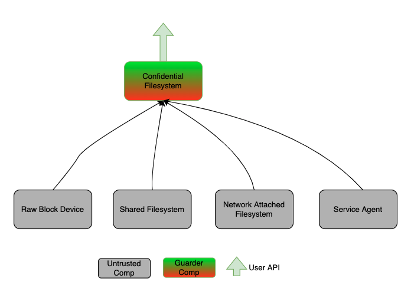

# Trusted Storage Subsystems for Confidential Containers

A trusted storage subsystem is needed/required by Confidential Containers, in addition to the confidential memory and
execution units provided by confidential CPU hardware architecture. This documentation tries to define trusted storage
subsystems for Confidential Containers.

## Design Goals

- **Be Permissible instead of Strictness**. The confidential container software stack is still in early stages, 
  new technologies for confidential containers may appear in near future. So let's focus on defining the legal/allowable
  storage software stacks instead of possible solutions, which may be limited by currently available technologies.
- **Flexibility**. The confidential container storage architecture should be flexible enough to support different
  usage scenarios, such as public cloud, hybrid cloud, private cloud and edge/distribute cloud etc. It should not
  enforce too much constraints on the deployment environment.
- **Storage Architecture for the Trusted Domain**. This documentation should only define storage architectures
  for the trusted domain. It may also give advices/recommendations for storage architectures outside of the trusted
  domain, but it should not define/enforce anything out of the trusted domain.
- **Focus on Confidentiality, Integrity instead of Performance**. There are always possible ways to improve performance,
  and always be possible to treat performance by cost. So it should focus on defining storage architecture to ensure
  confidentiality and integrity instead of improving performance.

## Assumptions

- All data originated from outside of the trusted domain are untrusted.
- With integrity check/decryption, untrusted data may be transformed/converted into trusted data.
- Trusted data stored within the trust domain will always be trustable.  
- It's legal to send integrity enforced/encrypted data to software data cache services provided by service providers.
- The secrets to verify/decrypt untrusted data should be derived from the remote attestation/KMS service.
- Trusted data will be always accessed through trusted filesystems. If users want to directly access data from raw block
  devices or untrusted filesystems, they must take the responsibility to verify/decrypt those data.
- Guest memory is a sort of precious resource. It should not be used to store large scale of ephemeral storage content.

## Candidate Technologies and Solutions

With goals and assumptions defined above, the task becomes to define a software stack to convert untrusted storage data
originated outside of the trusted domain into trusted filesystems within the trusted domain.

### Sources of Untrusted Storage Data

Let's first enumerate the possible sources of untrusted storage data as below:
- initrd (measured)
- virtio-blk devices
- virtio-scsi devices
- virtio-pmem devices  
- nvme devices
- virtio-fs devices
- virtio-9p devices
- network attached filesystems, such as NFS, CephFS etc. There's a special case for network attached filesystems, it may
  be trusted filesystem if it's connected to a trusted server through secure connections.
- software services providing storage data, for example an image cache service integrated into the image service.  

The storage subsystem may be composed up with multiple layers, so we may enforce confidentiality at different positions.
Here confidentiality enforcement means decryption and/or integrity verification.

### Enforce Confidentiality at The Data Source Layer

The confidentiality may be enforced at the data source layer, such as at the service agents or the NFS clients.
Possible storage stacks as below:

### Enforce Confidentiality at The Block Device Layer

The confidentiality may also be enforced at the block device layer, such as by using the dm-crypt/dm-verity.
Possible storage stacks as below:

### Enforce Confidentiality at The FileSystem Layer

The confidentiality may also be enforced at the filesystem layer, such as by using the to-be-invented filesystems.
Possible storage stacks as below:

### Composition of Confidential Filesystem

Once those confidential filesystems are ready, they could be composed up as normal filesystems in anyway, such as by
mount, bind mount, overlayfs, chroot or pivot etc.

## Ownership and Life Management of Storage Devices

With traditional Kata Containers, it aims to be compatible with runC and all filesystems are prepared on host, 
the Kata runtime just pass those storage resources into the guest. With confidential containers, that model doesn't
work anymore, it needs to prepare filesystems for containers within the vm.

In addition to normal container associated volume, a new concept of "pod built-in ephemeral volume/storage device" 
is introduced. The pod built-in ephemeral volume  which will be used to:
- host guest os temporary data 
- provide ephemeral volumes for containers
- store downloaded container images
- store rw layer of container rootfs

The lifecycle of the pod built-in ephemeral volume will be managed by the orchestration system or by the host.
It may be associated with the pod/container, and get destroyed when deleting the pod/container. Or it may be reused
for different pods/containers to improve performance.

### Overall Architecture

To summarize, we hope to build a layered confidential storage architecture for confidential containers as below:

## Available Technologies and Solutions

There are already many technologies available to build confidential storage for confidential containers.
List of candidate technologies as below:
- [dm-crypt](https://www.kernel.org/doc/html/latest/admin-guide/device-mapper/dm-crypt.html): provides transparent
  encryption of block devices using the kernel crypto API.
- [dm-integrity](https://www.kernel.org/doc/html/latest/admin-guide/device-mapper/dm-integrity.html): emulates a block
  device that has additional per-sector tags that can be used for storing integrity information.
- [dm-verity](https://www.kernel.org/doc/html/latest/admin-guide/device-mapper/verity.html): provides transparent
  integrity checking of readonly block devices using a cryptographic digest provided by the kernel crypto API.
- [loop-aes](https://sourceforge.net/projects/loop-aes/): adds AES encryption to loop devices and can be used to
  encrypt local file systems and disk partitions.
- [OpenZFS](https://openzfs.org/wiki/Main_Page): ZFS-Native Encryption which encrypts entire ZFS datasets or volumes.

## Default Solution for Confidential Containers

TODO: merge content from https://github.com/confidential-containers/documentation/issues/20

## Reference

- [A quick-start guide to OpenZFS native encryption](https://arstechnica.com/gadgets/2021/06/a-quick-start-guide-to-openzfs-native-encryption/)
