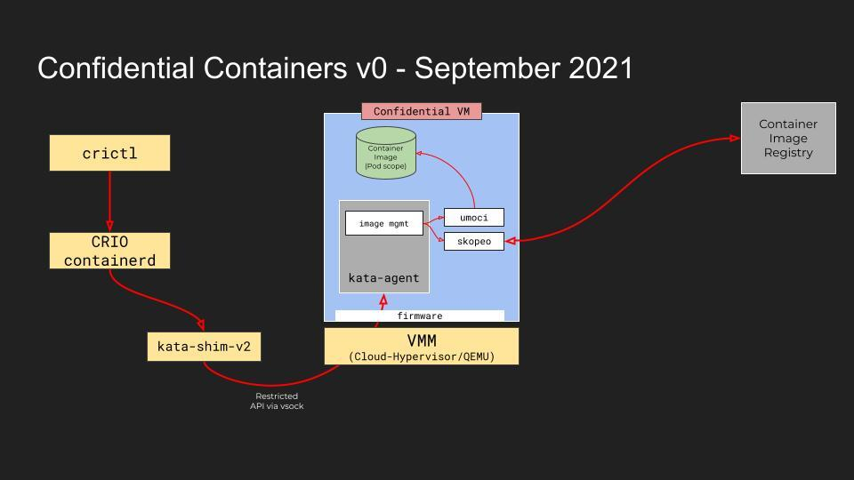
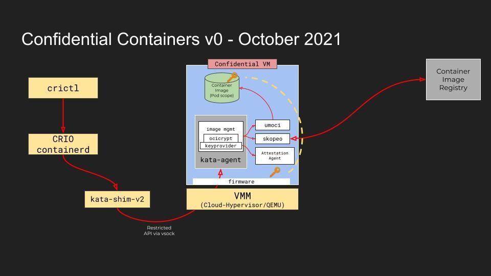
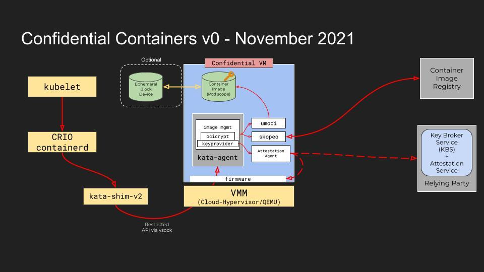

# Confidential containers roadmap
When looking at the project's roadmap we distinguish between short term roadmap (2-4 month) vs 
the mid/long term roadmap (4-12 month):
- The **short term roadmap** is focused on achieving an end-to-end easy to deploy confidential 
  containers solution using at 
least one HW encryption solution and integrated to k8s (with forked versions if needed)
- The **mid/long term solutions** focuses on maturing the components of the short term solution 
  and adding a number of 
enhancements both to the solution and the project (such as CI, interoperability with other 
  projects etc...)

# Short term roadmap
The short term roadmap aims to achieve the following:
- MVP stack for running confidential containers
- Based on and compatible with Kata Containers 2
- Based on at least one confidential computing implementation (SEV, TDX, SE, etc)
- Integration with Kubernetes: kubectl apply -f confidential-pod.yaml

The work is targeted to be completed by end of November 2021 and includes 3 milestones:

- **September 2021**
  - Unencrypted image pulled inside the guest, kept in tmpfs
  - Pod/Container runs from pulled image
  - Agent API is restricted
  - crictl only
  

- **October 2021**
  - Encrypted image pulled inside the guest, kept in tmpfs
  - Image is decrypted with a pre-provisioned key (No attestation)
  

- **November 2021**
  - Image is optionally stored on an encrypted, ephemeral block device
  - Image is decrypted with a key obtained from a key brokering service (KBS)
  - Integration with kubelet

For additional details on each milestone see [Confidential Containers v0](https://docs.google.com/presentation/d/1SIqLogbauLf6lG53cIBPMOFadRT23aXuTGC8q-Ernfw/edit#slide=id.p)

Tasks are tracked on a weekly basis through a dedicated spreadsheet. 
For more information see [Confidential Containers V0 Plan](https://docs.google.com/spreadsheets/d/1M_MijAutym4hMg8KtIye1jIDAUMUWsFCri9nq4dqGvA/edit#gid=0&fvid=1397558749).

# Mid term roadmap

Continue our journey using knowledge and support of Subject Matter Experts (SME's) in other 
projects to form stronger 
opinions on what is needed from components which can be integrated to deliver the confidential 
containers objectives.

- Harden the code used for the demos, 
- improve CI/CD pipeline, 
- clarify the release process
- Establish processes and tools to support planning, prioritisation, and work in progress
- Simple process to get up and running regardless of underlying Trusted Execution 
  Environment technology. 
- Develop a small, simple, secure, lightweight and high performance OCI container image 
  management library [image-rs](https://github.com/confidential-containers/image-rs) for 
  confidential containers.
- Develop small, simple shim firmware ( [td-shim](https://github.com/confidential-containers/td-shim) )
  in support of trusted execution environment for use with cloud native confidential containers.
- Document threat model and trust model, what are we protecting, how are we achieving it.
- Identify technical convergence points with other confidential computing projects both inside 
  and outside CNCF.

# Longer term roadmap

Focused meetings will be setup to discuss architecture and the priority of longer term objectives 
in the process of being setup.

Each meeting will have an agreed focus with people sharing material/thoughts ahead of time.

Topics under consideration:
- CI/CD + Repositories
- Community Structure and expectations
- 2 on Mid Term Architecture
	- Attestation 
	- Images
	- Runtimes  

Proposed Topics to influence long term direction/architecture.
- Baremetal / Peer Pod
- Composability of alternative technologies to deliver confidential containers.
- Performance 
- Identity / Service Mesh
- Reproducible Builds/Demos
- Edge Computing
- Reduce footprint of image pull

