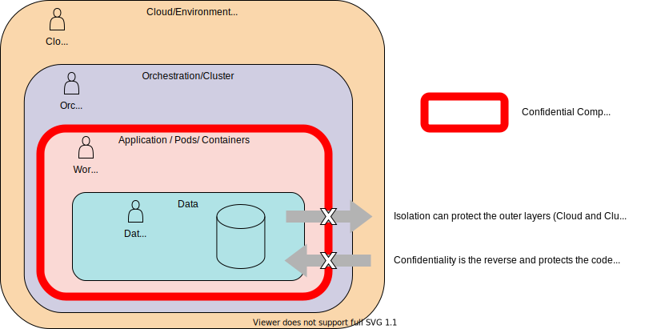
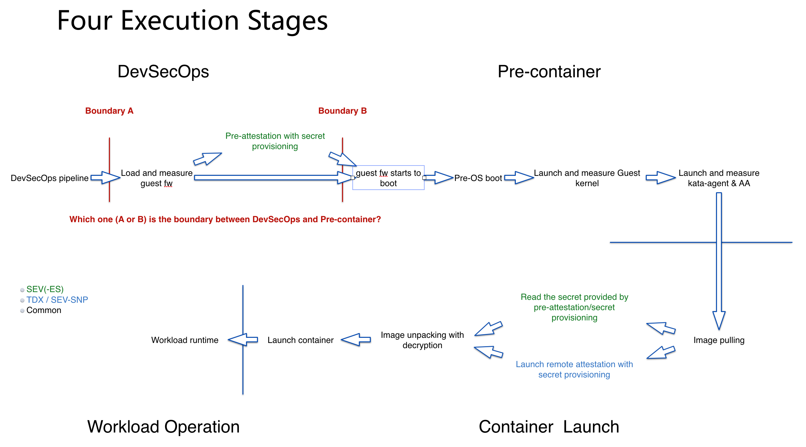

# Trust Model for Confidential Containers

## Motivation

Confidential Containers brings confidential computing into a cloud native context and should 
therefore refer to and build on trust and security models already defined.

For example: 

- Confidential Computing Consortium (CCC) published 
  "[A Technical Analysis of Confidential Computing](https://confidentialcomputing.io/wp-content/uploads/sites/85/2021/03/CCC-Tech-Analysis-Confidential-Computing-V1.pdf) [^1]" 
  section 5 of which defines the threat model for confidential computing.
- Cloud Native Computing Foundation Security Technical Advisory Group published 
  "[Cloud Native Security Whitepaper](https://github.com/cncf/tag-security/blob/main/security-whitepaper/CNCF_cloud-native-security-whitepaper-Nov2020.pdf) [^2]" 
- Kubernetes provides documentation on
  [an overview of cloud native security](https://kubernetes.io/docs/concepts/security/overview/) [^3]
- Open Web Application Security Project -
  [Docker Security Threat Modeling](https://github.com/OWASP/Docker-Security/blob/main/001%20-%20Threats.md) [^4]

A clear definition of trust and threats for the confidential containers project is needed to 
ensure the components and architecture deliver the security principles expected for cloud native 
confidential computing. It provides the solid foundations and unifying security principles 
against which we can assess architecture and implementation ideas and discussions.

This document highlights key concepts and background knowledge before progressing to an 
overarching trust model and highlighting areas in which threat vectors are considered.

Further documents will highlight more specific threat vectors in detail, considering risk, impact, 
mitigation etc as the project progresses. The Security Assurance section of CNCF Cloud 
Native Security Whitepaper[^2] will guide this more detailed threat vector effort.

---

## Personas
Otherwise referred to as actors or threat agents, these are individuals or groups capable of 
carrying out a particular threat. 
In identifying personas we consider :
- The Cloud Native Security Whitepaper Runtime Environment [^2] Figure 5. This highlights three 
  layers, Cloud/Environment, Workload Orchestration, Application.
- The Kubernetes overview of cloud native security [^3] identifies the 4C's of Cloud Native 
  Security as Cloud, Cluster, Container and Code. However data is core to confidential 
  containers rather than code.
- The Technical Analysis of Confidential Computing [^1] defines Confidential Computing is the  
  protection of data in use by performing computation in a hardware-based Trusted Execution Environment.

In considering personas we recognise that a trust boundary exists between each persona and we
explore how the least privilege principle (as described in Cloud Native security Paper, Page 36 
[^2] ) should apply to any actions which cross these boundaries.

 Confidential containers can provide enhancements to ensure that the 
expected  code/containers are the only code that can operate over the data. However any  
vulnerabilities within this code are not mitigated by using confidential containers, the Cloud  
Native Security Whitepaper details Lifecycle aspects that relate to the security of the code 
being placed into containers such as Static/Dynamic Analysis, Security Tests, Code Review etc 
which must still be followed. 

Anyone of these personas could attempt to perform malicious actions.

### Cloud Operator
This persona has privileges within the Cloud/Environment Infrastructure.
They are responsible for availability of infrastructure used by cloud native environment
- Has access to the physical hardware.
- Has access to the process involved in deploying VSI's.
- Has control over firmware versions
- Has control over TEE hardware availability/type

Example : Cloud Service Providers IaaS SRE's

### Orchestration Operator
This persona has privileges within the Orchestration/Cluster.
They are responsible for deploying a solution into a particular cloud native environment and 
managing the orchestration environment.
For Managed k8s cluster this would also include the administration of the cluster control plane.
- controls availability of service
- controls webhooks and deployment 
- controls availability of cluster resources (data/networking/storage)
- deploys protected boot image

Example : A kubernetes administrator responsible for deploying pods to a cluster and 
maintaining the cluster.

### Workload Provider
This persona has control over the code, containers and pods used to provide the Application or 
Workload.
They Define and builds an application or solution to provide business value to customers and 
clients.
The workload provider and end user could be part of same company/organisation but 
following the least privilege principle the application provider should not be able to view or 
manipulate end user data without informed consent.
- Owner of business logic containers. These may contain proprietary algorithms, models or secrets
- Needs to prove to customer aspects of compliance
- Defines what the solution requires in order to run (resources, utility containers/services, 
  storage) and maintain compliance
- provide the protected bootimage, or designate a trusted party to provide the protected 
  bootimage; In addition, provide the attestation verification service, or designate a trusted 
  party  to provide the attestation verification service.

Example : 3rd party software vendor

### Data Owner
Owner of data used, and manipulated by the application.
- concerned with visibility and integrity of their data
- concerned with compliance and protection of their data
- uses and shares data with solutions 
- least privilege principle means no visibility or manipulation of data is possible by 
  Orchestration Operator or Cloud Operator personas
Example : The end user/customer for the application

### Persona Trust

The key trust relationship here is between the Data Owner and the other personas. The Data Owner 
trusts the code provided by the workload provider to operate across their data, however they do 
not trust the Orchestration Operator or Cloud Operator with their data and wish to ensure 
data confidentiality.

The workload provider must not trust the Orchestration Operator or Cloud Operator  
otherwise they risk loosing the trust of the data owner. This means the workload provider must take 
steps to ensure the integrity of the code and that the data is appropriately protected, they may also 
wish to maintain confidentiality of their code from other personas.

## Lifecycle stages

**We need to align this with the Lifecycle part of the CNCF whitepaper document?****

The life cycle of confidential container can be roughly divided into 4 execution stages:

- DevSecOps : Preparation and build of container images and potentially the trusted boot image 
  for the TEE. Signatures and encryption keys for containers are prepared and available to 
  pre-container stage
- Pre-container stage: occurs before pulling container image. This stage contains the build and
initialization of TEEs. The involved components include the ones that directly associated with the
protections that TEEs provide (e.g, tdx seam-loader, tdx module, psp/sev firmware and so on),
Pre-OS (e.g, guest firmware, guest kernel, initrd and so on) and specific components (e.g,
kata-agent, attestation-agent and so on). Also includes preparing secrets for delivery to the TEE.

- Container launch stage: refers to the procedure of image pulling, unpacking and launching.

- Workload operation stage: refers to the procedure since the workload in the container starts to
run in TEEs.

These execution stages are sufficient to describe the execution of any forms of confidential
container. 

---

## Goals and not-goals

### Goals

The commonality of goals between confidential container and confidential computing are to reduce
the ability for the platform owner, operator and attacker to access data and code inside TEEs
sufficiently such that this path is not an economically or logically viable attack during
execution[^1]  5.1 Goal.

Around the three execution stages of confidential container, the scope of the threat model of
confidential container includes:

<* ADD diagram*>

- Pre-container stage
  - Measure the TEE where confidential containers run, and store the measurements to a secure location.

- Container launch stage
  - Measure and attest the TEE where confidential containers run to prove the deployment and initialization of pre-container are valid and expected;
  - Pull the encrypted and signed container image in TEE;
  - Provision the runtime configurations through a secure and attested control plane with the protections of confidentiality and integrity.

- Workload operation stage
  - Provide the protections of confidentiality and integrity for the storage and transport of data derived from TEE outside the TEE instance;
  - Keep the dynamic measurement of TEE where confidential containers run, and store the measurements to a secure location;
  - Continuously launch the runtime attestations for TEE where confidential containers run according to the policy to ensure the TEEs are not comprised or out-of-date;
  - Migration of confidential containers between TEE instances in a secure manner.

### Non-goals

The following itesm are considered out-of-scope for the threat model of confidential container: 

- The assurance of protections for application itself.

- The "Availability" in CIA Triad. A specific solution can provide the protection against availability attacks.

- Items related to any software TEEs.

---

## Confidential Computing Threat Vector Areas

The threat vectors[^1] 5.2.1 In-Scope considered to be in-scope for Confidential Computing are 
defined within the Confidential Computing Consortium Document. The following threat vectors are 
relate to confidential containers:

- Software supply chain attacks: include the attacks on components directly associated with the protections that specific TEEs provide, as well as pre-container components running inside TEEs. These components belong to the TCB of confidential container. Any attacks that may compromise TCB can fundamentally break the security of confidential container.

- Container image attacks: include the attacks on the container image. A container image includes the tenant's sensitive workload and data, so any attacks that may compromise the container image may cause the leakage of the tenant's sensitive information.

- Control plane attacks: include the attacks on K8s and container runtime control planes (such as CRI/shim/agent API). Traditionally, tenants trust these control planes controlled by the platform owner. If a specific confidential container based solution distrusts these control planes, the storage and transport of data over these control planes needs the protections for confidentiality and integrity. In addition, the Alternately, use another control plane to protect the data, e.g, a secure and attested control plane established with remote attestation procedure. In addition, the service APIs located at the trust boundary, e.g, agent API used by kata-cc, may cause trust boundary violation, without hardening or restriction.

- Storage of data attacks: include the attacks related to the storage of data derived by confidential container. These sensitive data belong to tenants, and the confidential container must provide the protections of confidentiality and integrity.

---

## Trust model

[Wikipedia](https://en.wikipedia.org/wiki/Trust_boundary) defines trust 
modeling as :

    A trust model identifies the specific mechanisms that are necessary to respond to a specific 
    threat profile.

    A trust model must include implicit or explicit validation of an entity's identity or the 
    characteristics necessary for a particular event or transaction to occur.

For the confidential containers, the TEE running the confidential container needs to provide a
reliable measurement across the life cycle of a confidential container. An attestation service 
fully verifies the validity of TEE measurements.
The purpose is to provide evidence for the application, container and code related personas that 
the that the workload in the confidential
container is running in a verified and genuine TEE. In summary: the trust model of confidential
container needs to address the trustworthiness of a TEE.

The trust model of confidential container closely focuses on the establishment of a chain of 
trust, through the above execution stages:

- SecDevOps : build the code and securely create secrets, encrypted containers and container 
  signatures.

- Pre-container stage: establish attestation measurements and extend the chain of trust, 
   to include creation and initialization of  a TEE in a secure manner, including using measured 
  boot and 
  / or secure boot during pre-container bootstrap.

- Container launch stage: extend the chain of trust to allow the container image 
  pulling, unpacking and launching to happen in a secure manner.

- Workload operation stage: extend the chain of trust to the workload and the End User data,    
 to ensure the  workload, derived data and incoming data are protected and verified in a secure manner.

There are many ways for actors in the ecosystem who rely on the security guarantees of a TEE to
establish trust in the TEE. This is the so-called trust policy. One trust policy is to obtain
assurance of security statements about products through assessment by third-party evaluation
laboratories. Other trust policies include basing assurances on security statements from specific
vendors; community or other audit of open source components in hardware, firmware, and/or software;
and assessment or certification by industry or standards bodies[1: 5.1 Goal]. Theoretically, the
trust policy can be fine-grained to the component level, so there are many combinations of the
trust policies that a specific solution may adopt basing on component level. In fact, different
forms of confidential container and specific solutions adopt the trust policy based on the
granularity of execution stage, that is, all components involved in each stage will follow the
same trust policy.

In practice, those deploying workloads into TEE environments may have varying
levels of trust in the workload orchestration or cloud personas 
hosting the
workload. This trust may be based on factors such as the relationship with the owner or operator of
the host, the software and hardware it comprises, and the likelihood of physical, software, or
social engineering compromise[1: 5.1 Goal].

Therefore, the level of trust ultimately determines what kind of trust model to adopt. The trust
model needs to define their own trust policies for the execution stages. There are many approaches
to implement trust policies. The most important thing is to ensure the chain of trust is never
broken, and the validity of TEE in attestation procedure is proved sufficiently. 

----

## Trusted Execution Environment Boundary
Core to confidential containers is the use of a Trusted Execution Environment which protects 
memory inside the environment from access in the clear by any actor outside the environment. 
ANd core to the trust model is where within a cloud native 
stack to 
put the Trusted Execution 
boundary when looking to deliver confidential containers.

Three main boundaries for the Trusted Execution Boundary are:
- Node
- Pod
- Container/Container Processes

<*Add Diagram*>

Each boundary changes requirements on what components must exist inside the TEE, the 
form the image to run inside the TEE takes and ultimately on the trust model.

### Node boundary
This uses a virtual machine with hardware TEE capability to run a K8s node.
The kubelet is inside the TEE boundary and therefore communication between api-server and 
kubelet would cross the boundary.
The 

### Pod Boundary
This uses a micro virtual machine (microVM) with hardware TEE capability.
The microVM contains an agent 

### Container/Container Process boundary
This uses an enclave to run a LibOS (Intel SGX Enclave)

In all cases the application code interacts with data within a hardware TEE

A brief comparison:

| | node | pod  | container/process |
| | vm-cc | microvm-cc/kata-cc\*1 | enclave-cc |
| :-: | :-: | :-: | :-: |
| TCB footprint | Large | Medium | Small |
| Location of trust boundary\*2 | between K8s API server and kubelet | agent API\*3 | ECALL and OCALL |
| Threat Surface | High | Medium | Low |
| Deployment complexity | High | Low | Medium |
| Changes to workload Orchestration Experience | Low | Medium | High |

Note:
1. This doc may use kata-cc equivalent to microvm-cc in order to refer to a kata-specific component.
2. Here refers to the trust boundary of control plane.
3. A component used in kata and running in POD.

Efforts so far have focused on the pod boundary using Kata containers as the technology to run a 
pod within the TEE boundary. We expect this document to align the pod and container approaches 
over time, but we believe that the node approach cannot deliver the required trust for 
confidential containers without significant changes throughout the stack which are currently 
beyond the scope of our efforts.

## Conclusion

The trust model determines the location and direction of the trust boundary. Trust boundary
describes a location where program data or execution changes its level of "trust," or where two
principals with different capabilities exchange data or commands[3]. The trust boundary of
confidential container is also the trust boundary of TEE. Generally, the TEE side at the trust
boundary should be hardened to prevent the violation of the trust boundary.

In general, the trust model adopted by any confidential container based solutions can be binarized
into:
1) Partially trust the platform owner, operator and privileged components controlled by host
2) Completely distrust the platform owner, operator and privileged components controlled by host

where 1) means that some components intruded into TCB can be unconditionally trusted by the tenant.
For example, a node based solution is likely to unconditionally trust the guest firmware provided
by host. On the contrary, a pod based solution is likely to verify the measurement of a
lightweight guest firmware provided by host during attestation procedure. Another example is, in
some cases, a tenant would like to trust the secret provisioned to the container through K8s API
server, and thus the threat vector "control plane attack" is not deemed as a trust boundary
violation. 2) is the preferred approach providing the protection for the confidential container
with the highest level of trust. Note: if a tenant fully trusts the platform owner, operator and
privileged components controlled by host, the TEE boundary will no longer be the trust boundary of
the confidential container, so in this case there is no need to use confidential computing.

TEE needs to focus on preventing potential security threats at the trust boundary and ensure 
that assurance on threats which can cross the boundary are controlled from within the boundary. 
We cannot allow the security of the TEE to be under control of operations outside the TEE or 
from areas not trusted by the TEE.

Note that the trust may change over time. Therefore, the trust model needs to be flexible enough to
allow the tenant to select different trust policy used in an execution stage.

---

## Reference

- [Trust Modeling for Security Architecture Development](https://www.informit.com/articles/article.aspx?p=31546)
- [OWASP Threat Modelling Cheat Sheet](https://cheatsheetseries.owasp.org/cheatsheets/Threat_Modeling_Cheat_Sheet.html)
---

- [^1]: Confidential Computing Consortium - [A Technical Analysis of Confidential Computing v1.1](https://confidentialcomputing.io/wp-content/uploads/sites/85/2021/03/CCC-Tech-Analysis-Confidential-Computing-V1.pdf)
- [^2]: Cloud Native Computing Foundation Security Special Interest Group -
        [Cloud Native Security Paper](https://github.com/cncf/tag-security/blob/main/security-whitepaper/CNCF_cloud-native-security-whitepaper-Nov2020.pdf)
- [^3]: Kubernetes - [Overview of Cloud Native Security](https://kubernetes.io/docs/concepts/security/overview/)
- [^4]: Open Web Application Security Project - [Docker Security Threat Modeling](https://github.com/OWASP/Docker-Security/blob/main/001%20-%20Threats.md)

